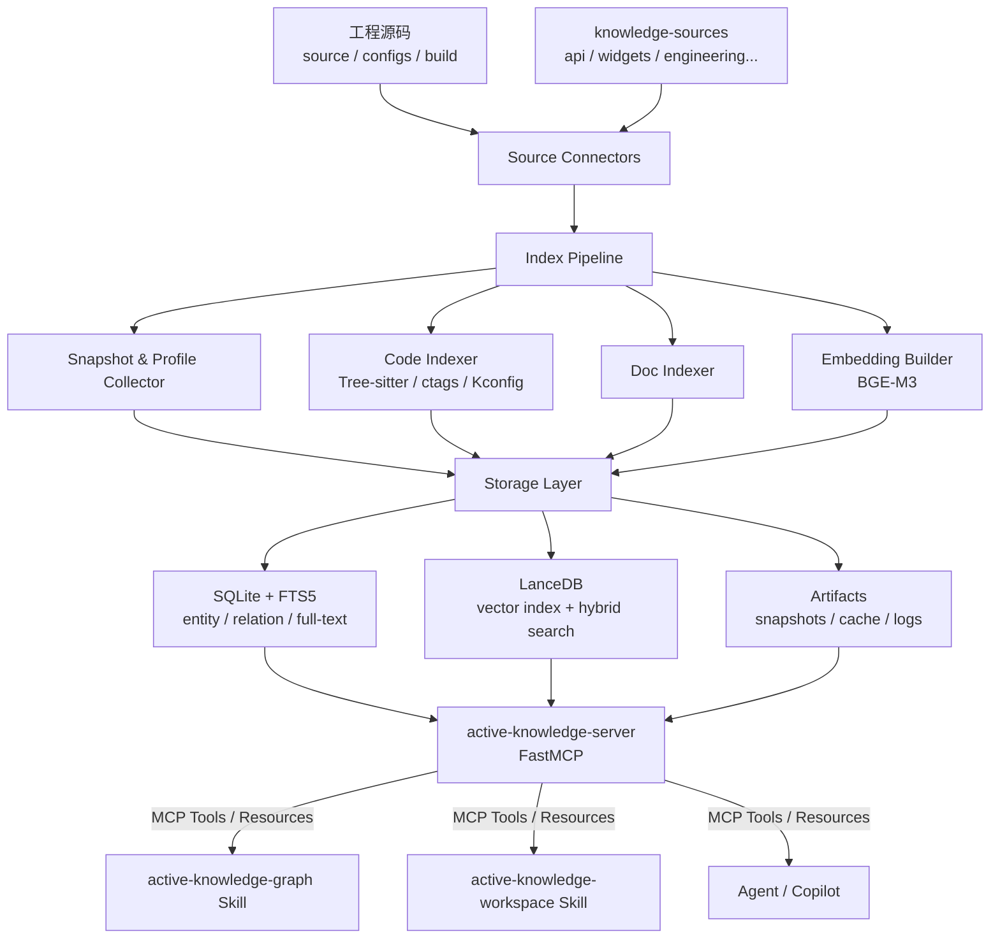

# active-knowledge

> 面向嵌入式 RTOS 工程的本地优先 RAG 知识库，整合工程源码、API 文档与控件使用文档，支持 Agent 与工程人员通过自然语言跨结构检索、精准理解复杂代码，同时帮助新人通过 RAG 辅助阅读快速上手项目。

---

## 为什么需要它

大型 RTOS 工程代码量庞大、模块边界复杂、编译配置多样（多 defconfig / board / profile），工程人员与 Agent 在以下场景均面临严重的检索和理解障碍：

- 某个 API 调用背后的实现在哪个模块、受哪个宏控制
- 一次消息从发出到处理的完整调用链路
- 新增一个 feature 需要改哪些层、改哪些配置
- 当前 profile 下哪些能力被裁剪，哪些被保留

`active-knowledge` 通过构建一个**本地优先、可分发、编译感知逐步增强**的 RAG 知识库来解决这些问题。它不依赖云服务，开箱即用，并通过标准 MCP 接口对 Agent 和 Skill 暴露稳定的查询能力。

---

## 核心特性

| 特性 | 说明 |
|------|------|
| **Hybrid Retrieval** | SQLite FTS5 全文检索 + LanceDB 向量检索混合召回，BM25 精准命中代码符号，向量语义补召回 |
| **编译感知** | 理解 Kconfig / defconfig / `.config` / `module.mk`，支持按 profile 过滤结果 |
| **Baseline + Overlay** | 发行包携带只读索引基线，用户本机写入增量 overlay，首次部署无需全量建库 |
| **稳定 MCP 接口** | 8 个经过契约冻结的 MCP Tools，供 Agent 和 Skill 稳定调用 |
| **多颗粒度代码查询** | 支持 workspace / directory / module / file / symbol / function / flow 等粒度 |
| **多视角理解** | workspace、layer、domain、feature、runtime、profile、evidence 七种视角 |
| **本地优先安全** | 默认只监听 `127.0.0.1`，全部工具调用写审计日志，运维工具默认不暴露 |

---

## 仓库结构

```
active-knowledge/
├── active-knowledge-server/   # FastMCP MCP 服务器（核心索引与查询引擎）
├── active-knowledge-graph/    # Skill：调用 MCP 工具进行知识图谱查询
├── active-knowledge-workspace/# Skill：工程目录导航与工作区结构理解
├── knowledge-sources/         # 知识源文档根目录（随仓库分发）
│   ├── api/                   # API / SDK 文档
│   ├── widgets/               # 控件使用文档
│   ├── engineering/           # 架构笔记、编码规范、调试指南
│   ├── product/               # 产品需求、功能说明
│   ├── design/                # UI 规范、交互说明
│   ├── project/               # 计划、里程碑、决策记录
│   ├── qa/                    # 测试策略、缺陷分析
│   ├── release/               # 发布说明、兼容性记录
│   └── learned-seeds/         # 精选知识卡片与回归样本
├── examples/                  # 配置示例（本地单用户 / 远程共享）
├── doc/                       # 架构设计与工程文档
└── .active-kb/                # 运行时工作目录（不纳入版本管理）
    ├── baseline/              # 只读索引基线（随发行包分发）
    └── local/                 # 用户本机增量 overlay
```

---

## 快速开始

### 1. 安装

```bash
pip install -e ./active-knowledge-server
```

### 2. 初始化工作目录

```bash
active-kb init --workspace /path/to/your/project
```

会在当前目录创建 `.active-kb/local/`，并生成 `active-kb.local.yaml` 配置文件。

### 3. 执行增量索引

```bash
# 索引源码 + 知识源文档
active-kb index

# 查看索引状态
active-kb status
```

### 4. 启动 MCP 服务器

```bash
# stdio 模式（供 Agent/Skill 直接调用）
active-kb serve

# HTTP 模式（本地调试）
active-kb serve --transport http
```

---

## MCP 工具（稳定接口）

以下 8 个工具构成 V1 的稳定查询契约，供 Agent 和 Skill 调用：

| 工具 | 定位 | 典型用途 |
|------|------|----------|
| `kb_search` | 统一混合召回入口 | 探索性、跨域、低上下文问题，先召回候选证据 |
| `code_resolve` | 符号 / 路径 / 宏定位 | 函数定义在哪、宏的值、结构体字段 |
| `code_context` | 符号上下文展开 | 函数实现、调用者/被调者、条件编译块 |
| `code_trace` | 调用链 / 消息链追踪 | ISR → task → queue → handler 完整链路 |
| `config_impact` | Profile / 宏影响分析 | 某 defconfig 下哪些模块被裁剪 |
| `docs_search` | API / 控件 / 文档检索 | 某接口的参数说明、控件用法示例 |
| `workspace_view` | 工程结构视图 | 顶层 area、子目录职责、模块归属 |
| `evidence_bundle` | 证据包打包 | 把多条检索结果打包为可引用的证据上下文 |

**工具串联示例：**

```
docs_search(doc_type=api, query="sensor register")
  → code_resolve(symbol="sensor_register")
  → code_context(symbol="sensor_register", depth=2)
  → evidence_bundle(items=[...])
```

---

## 知识源文档格式

放入 `knowledge-sources/` 的文档建议携带以下 front matter，以便索引时获得更精确的分类和权重：

```yaml
---
doc_type: api          # api | widgets | engineering | product | design | project | qa | release
domain: engineering    # 所属业务 / 技术域
version: "1.0"
authority_level: official   # official | contributed | draft
owner: your-team
tags: [sensor, driver]
---
```

---

## 配置说明

`active-kb.yaml`（随仓库分发）定义服务器和索引的静态配置；用户本机差异化配置写入 `.active-kb/local/active-kb.local.yaml`（不纳入版本管理）。

```yaml
# active-kb.yaml 核心字段示例
project:
  id: active
  workspace_root: /path/to/your/project  # 工程源码根目录
  default_profile: auto                  # 自动识别当前 defconfig

server:
  transport: stdio
  http:
    host: 127.0.0.1
    port: 8765

paths:
  include: [application, components, drivers, framework, ui]
  exclude: [.git, build/out, "**/.cache/**"]
```

完整配置示例见 [`examples/local-single-user.yaml`](examples/local-single-user.yaml) 和 [`examples/remote-shared.yaml`](examples/remote-shared.yaml)。

---

## 架构概览



**存储分层：**

```
.active-kb/
├── baseline/    ← 随发行包分发的只读基线索引（团队共享）
└── local/       ← 用户本机增量 overlay（gitignore，不上传）
```

---

## Skills

| Skill | 职责 |
|-------|------|
| **active-knowledge-graph** | 调用 `kb_search`、`code_resolve`、`code_trace`、`config_impact`、`evidence_bundle` 进行知识图谱式的代码理解与证据追踪 |
| **active-knowledge-workspace** | 调用 `workspace_view` 进行工程导航，解释目录职责、模块归属、层次关系，帮助快速建立工程心智模型 |

---

## CLI 命令速查

```bash
active-kb init       # 初始化本地工作目录
active-kb serve      # 启动 MCP 服务器
active-kb index      # 执行全量 / 增量索引
active-kb status     # 查看索引状态与统计
active-kb validate   # 校验索引完整性（CI 可消费 --format json）
active-kb eval run   # 运行评测集（--gate v1 触发 release gate）
active-kb baseline   # 管理只读基线快照
active-kb rebuild    # 清空并重建本地 overlay
active-kb migrate    # 索引格式版本迁移
active-kb clean      # 清理缓存与临时文件
```

---

## 技术栈

- **MCP 框架**：FastMCP (Python)
- **全文检索**：SQLite + FTS5
- **向量检索**：LanceDB（本地文件型，支持 hybrid search + reranking）
- **Embedding 模型**：BGE-M3
- **代码结构解析**：Tree-sitter、ctags、Kconfig / Makefile 解析器
- **编译感知（规划）**：`compile_commands.json` + clangd-compatible index

---

## 文档

| 文档 | 说明 |
|------|------|
| [架构与方案设计](doc/active_knowledge_server_architecture_design.md) | 完整的 Server 架构、存储模型、查询链路、MCP 接口设计 |
| [工程 TODO](doc/active_knowledge_server_engineering_todo.md) | 分阶段工程任务、契约冻结项、验收命令 |
| [评审变更追踪矩阵](doc/active_knowledge_server_review_trace.md) | 评审意见到设计章节、实现任务、测试任务和验收 gate 的追踪关系 |
| [MCP + Skill 全案设计](doc/rtos_engineering_kb_mcp_skill_full_design.md) | 面向大型 RTOS 项目的知识库 MCP 与 Skill 完整方案 |
| [Workspace Map](doc/active-knowledge-workspace-map.md) | 仓库顶层心智模型速查 |

---

## License

待定。
