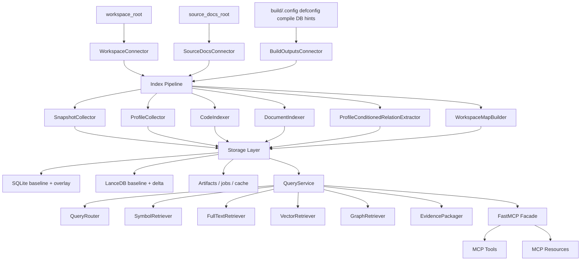

# Active Knowledge Server 使用与说明文档

> 文档状态：Working Guide  
> 更新日期：2026-06-24  
> 适用对象：`active-knowledge-server` 使用者、维护者、集成方  
> 相关文档：
> - [Active Knowledge Server 架构与方案设计](./active_knowledge_server_architecture_design.md)
> - [Active Knowledge Server 本地全功能集成测试](./active_knowledge_server_local_full_integration_test.md)
> - [Active Knowledge Server 工程化 TODO](./active_knowledge_server_engineering_todo.md)

---

## 1. 文档目标

本文不是单纯重复架构设计，也不是只给一组命令。它面向当前仓库里的真实实现，回答下面几类问题：

- 这个服务现在已经能做什么，哪些还是设计预留
- 从零开始怎样初始化、索引、启动和验证本地知识库
- `baseline + local overlay`、`snapshot`、`profile`、`job` 等核心概念分别是什么
- 当前 CLI、MCP Tools、MCP Resources、配置项和安全边界具体长什么样
- 如果要做本地单机、远程共享、基线发布、向量重建、回归评测，应该走什么流程

本文以“当前代码实现”为准，优先描述已经落地的行为；对于未来能力，会明确标注为“演进方向”，避免把设计稿误当作现网功能。

---

## 2. 一句话理解系统

`active-knowledge-server` 是一个面向大型工程代码和知识文档的本地优先知识检索服务。它会扫描工程工作区和 `knowledge-sources/` 文档目录，建立：

- SQLite 元数据与 FTS 检索索引
- LanceDB 文档向量索引
- 可增量恢复的本地索引 job 状态
- 面向 Agent/Skill 的 MCP 查询接口

它的关键产品设计不是“把文件切块后扔进向量库”，而是：

- 代码问题优先依赖结构化索引、全文检索和符号解析
- 文档问题走 markdown/html 解析、front matter 分类和向量补召回
- 用 `baseline` 表示可分发、可复用的只读知识基线
- 用 `local overlay` 表示用户本机增量更新，避免首次部署必须全量建库

---

## 3. 当前实现范围

### 3.1 已经实现的核心能力

- 配置加载、变量展开和优先级合并
- 本地工作目录初始化与 SQLite store 初始化
- workspace 扫描、知识文档扫描、build/profile 发现
- 增量索引 pipeline 与可恢复 index job
- 全量索引、staging 校验、publish pointer 切换
- SQLite 元数据/FTS、LanceDB baseline/delta 存储
- Hybrid query service：symbol + FTS + vector + graph expand + rerank
- 8 个稳定查询 MCP tools
- 7 个只读 MCP resources
- 本地/远程两种部署模式的 fail-safe 安全校验
- audit、secret scan、path guard、storage consistency validate
- eval / perf / stability / release checklist 命令

### 3.2 当前实现中的重要边界

- 文档解析当前以 `markdown`、`html` 为主；`pdf` 默认关闭。
- 文档扫描能识别更多扩展名，但若没有对应 parser，会被标记为 `docs.format_unsupported` 后跳过。
- 代码索引当前以 workspace 扫描、ctags/C-family 解析、makefile/Kconfig 等轻量结构化能力为主。
- `clang_index` 配置位已经预留，但默认关闭，不应视为当前主路径。
- `remote_shared` 模式下默认不允许暴露 ops tools。
- `--resume JOB_ID` 目前只支持“本地增量索引”路径，不支持所有 full index 场景。

### 3.3 适合的典型场景

- 新人快速理解 RTOS / embedded 工程目录、模块和配置关系
- 用自然语言定位函数、宏、模块、文档章节和配置影响
- 构建一份随源码分发的 baseline，让团队成员在本机只做增量 overlay
- 为 Skill、MCP Client、IDE Agent 提供稳定、可审计的知识查询入口

---

## 4. 核心概念

### 4.1 Workspace

`project.workspace_root` 指真实工程根目录。代码索引、profile 发现、workspace view 都以它为边界。

### 4.2 Knowledge Sources

`runtime.source_docs_root` 指知识文档根目录，默认是仓库顶层的 `knowledge-sources/`。当前支持的标准分类包括：

- `api`
- `widgets`
- `engineering`
- `product`
- `design`
- `project`
- `qa`
- `release`
- `learned-seeds`

### 4.3 Baseline

`baseline` 是只读知识基线，通常随发行包或源码分发。它包含：

- baseline metadata SQLite
- baseline 向量库
- baseline artifacts
- `baseline/manifest.json`

普通查询和本地增量索引默认不写 baseline；只有显式 baseline publish / baseline build 流程会写。

### 4.4 Local Overlay

`local overlay` 是用户本机可写层，存放：

- overlay metadata SQLite
- jobs SQLite
- 向量 delta
- cache、logs、tmp、artifacts、locks

本地日常索引默认写到这里。

### 4.5 Snapshot

一次索引会生成一个逻辑 snapshot。查询默认使用 `current`，也可以显式指定 `snapshot_id`。

### 4.6 Profile

profile 表示某个 defconfig / `.config` / board / app 的配置视角。它影响：

- 查询时的结果过滤
- `config_impact` 的 profile diff
- 某些 relation 的 profile-conditioned 可见性

默认 profile 可为 `auto`，由 profile collector 按候选和置信度解析。

### 4.7 Index Job

每次索引都有持久化 job 记录。增量索引支持：

- `--resume auto`
- `--resume JOB_ID`
- `--restart`
- `--no-resume`
- `--job-id JOB_ID`

job 会记录状态、checkpoint、resume 次数、计划签名和任务统计。

---

## 5. 总体架构



### 5.1 代码中的主要模块映射

- 配置与路径：`src/active_knowledge_server/config/*`
- 连接器：`src/active_knowledge_server/connectors/*`
- 索引：`src/active_knowledge_server/indexing/*`
- 查询：`src/active_knowledge_server/query/*`
- 存储：`src/active_knowledge_server/storage/*`
- MCP：`src/active_knowledge_server/mcp/*`
- 安全：`src/active_knowledge_server/security/*`
- CLI：`src/active_knowledge_server/cli.py`

---

## 6. 目录与运行时布局

### 6.1 仓库侧典型布局

```text
active-knowledge/
├── active-knowledge-server/
├── knowledge-sources/
├── examples/
├── doc/
└── .active-kb/
    ├── baseline/
    └── local/
```

### 6.2 `active-kb init` 后的工作目录

```text
.active-kb/
├── baseline/
│   ├── config/
│   ├── db/
│   ├── vectors/
│   └── artifacts/
└── local/
    ├── config/
    │   └── active-kb.local.yaml
    ├── db/
    │   ├── overlay.db
    │   └── jobs.db
    ├── vectors/
    ├── artifacts/
    ├── cache/
    ├── logs/
    ├── tmp/
    └── locks/
```

### 6.3 日志文件

当前运行时会在 `.active-kb/local/logs/` 下创建固定日志文件：

- `server.log`
- `indexer.log`
- `audit.log`
- `security.log`
- `eval.log`

---

## 7. 配置模型与优先级

### 7.1 优先级

配置优先级固定为：

```text
CLI > ACTIVE_KB_* environment > local config > baseline config > defaults
```

### 7.2 常见配置来源

- baseline/static config：`active-kb.yaml` 或 `.active-kb/baseline/config/baseline.yaml`
- local config：`.active-kb/local/config/active-kb.local.yaml`
- CLI 覆盖：如 `--workspace`、`--workdir`、`--profile`
- 环境变量覆盖：如 `ACTIVE_KB_WORKSPACE`

### 7.3 目前支持的环境变量

- `ACTIVE_KB_CONFIG`
- `ACTIVE_KB_LOCAL_CONFIG`
- `ACTIVE_KB_WORKDIR`
- `ACTIVE_KB_WORKSPACE`
- `ACTIVE_KB_SOURCE_DOCS_ROOT`
- `ACTIVE_KB_PROFILE`
- `ACTIVE_KB_TRANSPORT`
- `ACTIVE_KB_HTTP_HOST`
- `ACTIVE_KB_HTTP_PORT`
- `ACTIVE_KB_LOG_LEVEL`

### 7.4 关键配置段说明

#### `deployment_mode`

- `local_single_user`：本机单用户，默认模式
- `remote_shared`：远程共享服务，安全要求更严格

#### `server`

- `transport`：当前核心值是 `stdio` 或 `streamable-http`
- `expose_ops_tools`：是否暴露 MCP 运维工具
- `http.host / port / mcp_path`：HTTP 传输配置

#### `runtime`

- `workdir`：总工作目录
- `baseline_dir` / `local_dir`：可由 `workdir` 派生
- `source_docs_root`：知识文档根目录
- `log_level` / `logging.rotation`：日志策略

#### `project`

- `workspace_root`：真实工程根目录
- `default_snapshot`：默认 `current`
- `default_profile`：常见值是 `auto`

#### `paths`

- `include`：仅扫描这些路径
- `exclude`：忽略这些路径

#### `profiles`

- `discovery.defconfig_roots`
- `discovery.dotconfig_candidates`
- `known[]`：显式配置的 profile seed

#### `storage`

- `metadata`：baseline metadata SQLite
- `overlay`：本地 overlay SQLite
- `jobs`：jobs SQLite
- `vector`：baseline LanceDB
- `vector_delta`：本地 delta LanceDB
- `sqlite`：journal / synchronous / WAL 相关开关

#### `indexing`

- `incremental`
- `reuse_baseline`
- `workers`
- `parallel.mode`
- `writer.batch_size`
- `writer.max_files_per_transaction`
- `writer.max_records_per_transaction`
- `writer.commit_interval_ms`
- `code.enable_ctags / enable_tree_sitter / enable_clang_index`
- `docs.enable_markdown / enable_html / enable_pdf`
- `embeddings.enabled / provider / model / batch_size`

#### `query`

- `default_top_k`
- `max_evidence_items`
- `hybrid.enable_fts`
- `hybrid.enable_vector`
- `hybrid.enable_symbol`
- `hybrid.enable_graph_expand`
- `hybrid.rerank`

#### `security`

- `path_allowlist`
- `secret_scan.enabled`
- `audit.enabled`

### 7.5 示例配置建议

本仓库根目录已经提供：

- `examples/local-single-user.yaml`
- `examples/remote-shared.yaml`

首次落地建议直接从这两个文件复制，而不是从零手写。

---

## 8. 安装与首次启动

### 8.1 在仓库内开发使用

```bash
cd active-knowledge-server
uv sync
uv run active-kb --version
```

### 8.2 以可编辑包方式安装

```bash
pip install -e ./active-knowledge-server
active-kb --version
```

### 8.3 初始化本地工作目录

```bash
active-kb init \
  --workspace /path/to/your/workspace \
  --source-docs-root /path/to/knowledge-sources \
  --reuse-baseline
```

这一步会：

- 创建 `.active-kb/` 目录骨架
- 生成本地配置文件
- 初始化 `overlay.db` 与 `jobs.db`
- 检查 baseline manifest 是否存在
- 检查 `.active-kb/local` 下是否有不该被 git 跟踪的运行时文件

### 8.4 初始化后先做两步检查

```bash
active-kb validate --format json
active-kb status --format json
```

---

## 9. 日常使用流程

### 9.1 本地单机推荐流程

```bash
active-kb init --config examples/local-single-user.yaml
active-kb validate --config examples/local-single-user.yaml --format json
active-kb index --config examples/local-single-user.yaml --incremental
active-kb serve --config examples/local-single-user.yaml --transport stdio
```

### 9.2 查看状态

```bash
active-kb status --format text
active-kb status --format json
```

`status` 会汇总：

- 配置摘要
- 关键路径存在性
- baseline reuse 状态
- profile 发现状态
- index / storage validation 简报

### 9.3 基础校验

```bash
active-kb validate --strict --format json
```

`validate` 比 `status` 更严格，会做：

- 路径检查
- storage consistency validate
- baseline / profile / index 状态汇总

当 storage report 为 `blocked` 时，命令返回非零退出码。

### 9.4 启动 MCP 服务

本地推荐：

```bash
active-kb serve --transport stdio
```

如果你只想先看 launch plan，而不是立即常驻运行：

```bash
active-kb serve --format json
```

本地 HTTP 调试：

```bash
active-kb serve --transport streamable-http --host 127.0.0.1 --port 8765
```

`serve` 在真正启动前会先跑 fail-safe security validation；如果配置不安全，会直接返回 `blocked`。

### 9.5 远程共享示例

```bash
ACTIVE_KB_AUTH_TOKEN='<strong-random-token>' \
active-kb serve --config examples/remote-shared.yaml
```

推荐做法：

- 先 `validate --config examples/remote-shared.yaml`
- 用环境变量或密钥系统注入 token
- 只暴露 query tools，不暴露 ops tools
- 放在可信反向代理之后

---

## 10. 索引模型与命令

### 10.1 增量索引

最常用的是本地 overlay 增量索引：

```bash
active-kb index --incremental --target local --source all
```

等价默认含义通常是：

- mode：incremental
- target：local
- source：all

增量索引的核心特点：

- 先做 plan，再按变化范围执行
- 使用 persisted job 和记忆 checkpoint
- 支持 resume / restart
- 结果写入本地 overlay，而不是覆盖 baseline

### 10.2 全量索引

```bash
active-kb index --full --target local --source all
```

full index 更适合：

- 本地 overlay 完整重建
- baseline 构建前的全量跑通
- schema 或索引结构变化后的重新构建

### 10.3 source 维度

可选值：

- `all`
- `code`
- `docs`

例如只重建文档：

```bash
active-kb index --incremental --target local --source docs
```

### 10.4 resume 语义

当前 CLI 支持：

```bash
active-kb index --resume auto
active-kb index --resume JOB_ID
active-kb index --restart
active-kb index --no-resume
active-kb index --job-id index:my-run
```

要点：

- `--resume auto`：尝试继续“最新兼容 job”
- `--resume JOB_ID`：显式恢复指定 job
- `--restart`：对兼容旧 job 做 supersede，再新开
- `--no-resume`：禁用恢复
- `--resume JOB_ID` 当前只支持“本地增量索引”

### 10.5 全量索引的 staging / publish 机制

对于 full index，系统支持先写 staging，再做校验和 publish pointer 切换：

1. 收集 snapshot、profile、code、docs
2. 写入 staging metadata / vector
3. 运行 storage validation
4. 若通过，则原子切换 publish manifest
5. 若未通过，则返回 `partial_ready`，跳过 publish

这个设计的目的，是避免把“半构建完成的索引”直接暴露给读者。

---

## 11. Baseline 生命周期

### 11.1 校验 baseline

```bash
active-kb baseline validate --format json
```

会检查：

- `baseline/manifest.json`
- baseline 存储一致性
- 与 baseline 相关的 validation checks

### 11.2 发布 baseline

```bash
active-kb baseline publish \
  --source all \
  --baseline-id release-20260624 \
  --publish-mode publish
```

它会：

- 运行 baseline 写入路径的 full index
- 生成/覆盖 `baseline/manifest.json`
- 产出新的 baseline id

### 11.3 baseline 写入保护

普通索引不会随便写 baseline。凡是写 baseline 的路径，都要求显式声明 publish/build intent，防止误操作。

---

## 12. 向量重建与清理

### 12.1 只重建向量

```bash
active-kb rebuild --vectors --target local --source docs
```

适用场景：

- embedding model 变化
- 向量 manifest 损坏
- 文档 metadata 可保留，但向量需要重建

### 12.2 清理本地运行时文件

```bash
active-kb clean --cache --tmp
active-kb clean --old-jobs --old-snapshots
active-kb clean --staging-jobs --published-history
active-kb clean --compact-overlay
```

`clean` 主要面向：

- cache / tmp 清理
- 历史 job 清理
- 失败或过期 staging 清理
- 已发布旧版本清理
- overlay 控制表 compact 与 FTS 重建

---

## 13. 查询服务工作方式

### 13.1 查询请求模型

当前内部统一查询请求包含：

- `query`
- `domain`
- `view`
- `granularity`
- `profile_id`
- `snapshot_id`
- `caller_tool`
- `client_context`

### 13.2 查询 intent

当前实现中的主要 intent 包括：

- `code_exact`
- `code_concept`
- `call_trace`
- `runtime_flow`
- `profile_diff`
- `api_lookup`
- `widget_lookup`
- `workspace_nav`
- `product_context`
- `project_context`
- `evidence_lookup`
- `unknown`

### 13.3 检索链路

`QueryService` 会按 router 决策组合下面几类 retriever：

- `SymbolRetriever`
- `FullTextRetriever`
- `VectorRetriever`
- `GraphRetriever`

然后再做：

- fusion
- rerank
- evidence packaging

### 13.4 为什么不是纯向量检索

因为工程问题里有很多高精度 token：

- 宏名
- 函数名
- 类型名
- 文件路径
- 错误码
- 配置项

这类问题单靠 embedding 很容易误召回，所以当前实现明确保留 FTS、symbol 和 graph 路径。

---

## 14. MCP Tools

### 14.1 Bootstrap tools

- `ping`
- `server_info`

### 14.2 稳定查询 tools

#### `kb_search`

通用混合检索入口，适合探索性问题。

关键参数：

- `query`
- `domain`
- `view`
- `granularity`
- `profile_id`
- `snapshot_id`

#### `docs_search`

用于 API / widget / product / project 文档检索。

额外参数：

- `doc_type`: `api | widget | product | project`

#### `code_resolve`

用于精确定位符号、宏、路径、文件锚点。

默认：

- `domain=code`
- `view=code`
- `granularity=symbol`

#### `code_context`

用于模块、概念、子系统上下文解释。

默认更偏：

- `view=code`
- `granularity=module`

#### `code_trace`

用于调用链、运行链、消息链分析。

默认更偏：

- `view=runtime`
- `granularity=flow`

#### `config_impact`

用于 profile / 宏 / 配置影响分析。

额外参数：

- `compare_to`

#### `workspace_view`

返回 live workspace projection。

参数：

- `view`: `workspace | layer | domain | feature | profile`
- `query`
- `limit`

#### `evidence_bundle`

有两种用法：

- 基于 `query` 打包证据
- 基于 `entity_id` 打包证据

当 `query` 和 `entity_id` 都缺失时会直接返回 `blocked`。

### 14.3 Ops tools

只有在下面两个条件同时满足时才会暴露：

- `deployment_mode=local_single_user`
- `server.expose_ops_tools=true`

当前 ops tools 包括：

- `ops_get_config`
- `ops_validate_setup`
- `ops_index_status`
- `ops_start_index`
- `ops_cancel_index`
- `ops_resume_index`
- `ops_list_profiles`
- `ops_list_sources`

`remote_shared` 下不允许暴露这些工具。

---

## 15. MCP Resources

### 15.1 Bootstrap resources

- `active://config/current`
- `active://server/runtime`

### 15.2 Query resources

- `active://snapshot/current`
- `active://profile/{profile_id}`
- `active://workspace/current/summary`
- `active://workspace/current/tree`
- `active://entity/{entity_id}`
- `active://evidence/{evidence_id}`
- `active://index/status`

这些资源适合：

- 读取当前运行时摘要
- 拉取 profile / entity / evidence 的只读上下文
- 让 Skill 或 Agent 在不执行写操作的前提下补充背景信息

---

## 16. 查询结果契约

所有 V1 查询工具共用 `QueryResult` 外壳，重点字段包括：

- `tool_name`
- `result_status`
- `confidence`
- `confidence_band`
- `query_intent`
- `summary`
- `items`
- `candidates`
- `entities`
- `relations`
- `evidence_refs`
- `warnings`
- `next_queries`
- `suggested_filters`
- `diagnostics`

### 16.1 关键 `result_status`

- `ok`
- `zero_result`
- `multi_result`
- `ambiguous`
- `low_confidence`
- `partial_ready`
- `blocked`
- `error`

### 16.2 使用方应该怎么处理

- `zero_result`：不要编造答案，优先用 `next_queries`
- `multi_result`：先做 disambiguation，再继续
- `ambiguous`：根据 `diagnostics.required_context` 补上下文
- `low_confidence`：允许做探索性解释，但必须显式说明不确定性
- `partial_ready`：说明索引不完整，避免给出“全局确定结论”
- `blocked`：先修环境、安全或输入问题，不要继续假装回答

---

## 17. 文档编写与知识源组织建议

### 17.1 当前推荐 front matter

```yaml
---
title: Sensor Register API
authority_level: official
tags: [sensor, register]
module: sensor
version: "1.0"
code_symbols: [sensor_register]
---
```

### 17.2 类别建议

- `api/`：接口、SDK、协议、寄存器说明
- `widgets/`：控件和 UI 组件文档
- `engineering/`：架构说明、调试指南、规范
- `product/`：产品能力与需求语义
- `project/`：计划、里程碑、决策记录

### 17.3 当前解析注意事项

- markdown 和 html 的效果最好
- 无 parser 的格式会被扫描到，但不会被真正入库
- `api` 文档若缺少 `version`，当前会有 `docs.version_missing` warning

---

## 18. 安全模型

### 18.1 本地单机

`local_single_user` 的默认策略是：

- 推荐 `stdio`
- 如果走 HTTP，只允许 loopback host
- 默认不暴露 ops tools
- audit 默认开启

### 18.2 远程共享

`remote_shared` 必须同时满足：

- `server.transport=streamable-http`
- `server.http.require_auth=true`
- token source 可用
- `allowed_origins` 不能是 `*`
- `security.audit.enabled=true`
- `server.expose_ops_tools=false`

任何一项不满足，`serve` 都会 fail-safe 阻断启动。

### 18.3 Path Guard

path guard 会约束访问范围到 allowlist 内，默认包括：

- `${project.workspace_root}`
- `${runtime.source_docs_root}`
- `${runtime.workdir}`

它会阻止：

- `..` 越界
- symlink escape
- 非允许根路径访问

### 18.4 Secret Scan

当前支持在索引/文档处理过程中做敏感信息扫描。常见 deny pattern 如：

- 私钥头
- 云访问 key 形态

---

## 19. 审计与可观测性

### 19.1 Audit

所有 MCP tool 调用和 ops 行为都会走 audit 记录，目标是：

- 可追溯谁调用了什么
- 记录 warning code、结果状态和摘要
- 避免把整段源码原文写进日志

### 19.2 Validate

`validate_storage_consistency()` 会检查：

- SQLite schema version
- vector manifest schema
- FTS 与 metadata 一致性
- vector ref 完整性
- evidence / relation target 完整性
- tombstone leak
- replacement loop
- job lock 状态

---

## 20. 评测与发布流程

### 20.1 Quality Eval

```bash
active-kb eval run --gate quality \
  --report .active-kb/local/artifacts/eval/quality.json
```

### 20.2 Performance Gate

```bash
active-kb perf run --gate performance \
  --report .active-kb/local/artifacts/perf/performance.json
```

### 20.3 Stability Gate

```bash
active-kb stability run --gate stability \
  --report .active-kb/local/artifacts/stability/stability.json
```

### 20.4 Release Baseline

```bash
active-kb eval-baseline save \
  --baseline-id release-20260624 \
  --quality-report .active-kb/local/artifacts/eval/quality.json \
  --performance-report .active-kb/local/artifacts/perf/performance.json
```

```bash
active-kb eval-baseline compare \
  --quality-report .active-kb/local/artifacts/eval/quality.json \
  --performance-report .active-kb/local/artifacts/perf/performance.json
```

### 20.5 Release Checklist

```bash
active-kb release checklist \
  --quality-report .active-kb/local/artifacts/eval/quality.json \
  --performance-report .active-kb/local/artifacts/perf/performance.json \
  --stability-report .active-kb/local/artifacts/stability/stability.json
```

---

## 21. 推荐的落地实践

### 21.1 个人本机使用

- 直接使用 `examples/local-single-user.yaml`
- transport 优先 `stdio`
- baseline 放随仓库分发的只读层
- 日常只做 `index --incremental --target local`

### 21.2 团队内部分发

- 由 CI 或维护者定期执行 `baseline publish`
- 把 baseline 随源码/版本一起发
- 每个使用者本地只维护 overlay 和 jobs

### 21.3 远程服务化前先做什么

- 先跑通本地 validate / eval / perf / stability
- 确认 token 注入、allowed origins、audit、反向代理边界
- 不要一开始就把 ops tools 暴露到远程

---

## 22. 常见问题与排障

### 22.1 `serve` 被 blocked

优先检查：

- deployment mode 是否正确
- `remote_shared` 是否开启了认证
- `allowed_origins` 是否误配成 `*`
- 是否错误暴露了 ops tools

### 22.2 `validate` 报 schema mismatch

通常表示：

- SQLite schema 版本不对
- vector manifest schema 不对

先考虑重新初始化、迁移或重建索引，不要直接绕过。

### 22.3 文档明明在 `knowledge-sources/` 里却搜不到

常见原因：

- 文件格式被扫描到，但 parser 未启用
- front matter 缺失导致分类不准
- 还没执行 `index`
- 查询 domain / doc_type 过窄

### 22.4 resume 没生效

优先确认：

- 是否是本地增量索引
- `plan signature` 是否兼容
- 旧 job 是否已 ready / superseded / cancelled

### 22.5 想开启 SQLite WAL

当前必须显式满足：

- `storage.sqlite.journal_mode=wal`
- `storage.sqlite.assume_local_filesystem=true`

否则配置校验不会通过。

---

## 23. 当前限制与演进方向

当前限制：

- 代码理解仍以轻量结构化路径为主，clang/compile DB 深度能力还不是默认主路径
- 文档解析以 markdown/html 为主
- ops tools 仅定位本地可信环境
- full index 的恢复能力还没有像本地增量那样完善

演进方向：

- 更强的 compile-aware code intelligence
- 更完整的增量 task ledger 与 resume
- 更多文档格式 parser
- 更丰富的 remote auth / multi-user 治理
- 更细粒度的 learned cards / domain knowledge 生产链路

---

## 24. 最短上手命令清单

如果你只想先跑起来，按下面顺序：

```bash
cd active-knowledge-server
uv sync
uv run active-kb init \
  --config ../examples/local-single-user.yaml
uv run active-kb validate \
  --config ../examples/local-single-user.yaml \
  --format json
uv run active-kb index \
  --config ../examples/local-single-user.yaml \
  --incremental
uv run active-kb serve \
  --config ../examples/local-single-user.yaml \
  --transport stdio
```

如果你是维护者，下一步建议继续看：

- [Active Knowledge Server 架构与方案设计](./active_knowledge_server_architecture_design.md)
- [Active Knowledge Server 本地全功能集成测试](./active_knowledge_server_local_full_integration_test.md)
