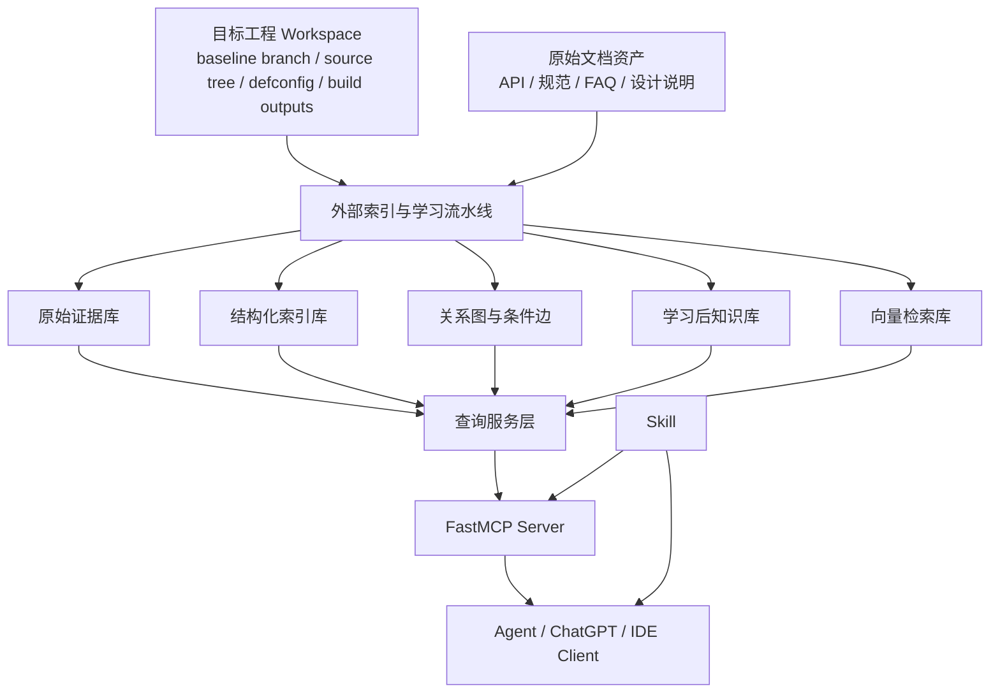

# 面向大型 RTOS 项目的知识库 MCP + Skill 全案设计（正式版）

> 文档状态：Draft for Review  
> 文档目的：将前期调研结论收敛为可评审、可拆解、可实施的正式方案  
> 适用范围：大型 RTOS、多仓、跨 profile、跨语言、工程外部运行的知识库系统  
> 相关前置文档：
> - [RTOS 多仓嵌入式工程知识库方案（对话汇总版）](./rtos_engineering_kb_plan_summary.md)
> - [Workspace Map](./active-knowledge-workspace-map.md)

---

## 1. 文档定位

本文档给出一份完整的 `知识库系统 + MCP 接口层 + Skill` 设计方案，用于支撑 Agent 在大型 RTOS 工程中的代码理解、文档检索、跨层链路分析和证据化回答，并为后续扩展到产品、设计、项目管理等多角色知识场景预留架构空间。

本文档重点回答以下问题：

- 为什么知识库必须运行在目标工程目录之外
- 为什么应采用 `Python + FastMCP` 作为 MCP 门面
- 如何同时管理原始文档与学习后生成的知识库
- 如何定义适合 RTOS 场景的 MCP 工具面
- 如何设计一个稳定、低幻觉、证据优先的 Skill
- 如何让系统从研发知识库扩展为面向多角色的统一知识底座
- 如何让系统满足大型工程的最佳实践

本文档不包含具体实现代码，但会给出明确的模块边界、目录建议、配置草案、数据模型和实施阶段。

---

## 2. 目标与范围

### 2.1 目标

构建一套面向大型 RTOS 项目的外部知识系统，使 Agent 能够：

- 基于 `baseline branch snapshot + defconfig profile` 理解真实代码宇宙
- 快速定位目录、模块、repo 与文档资产的位置及职责
- 在代码、文档、规范、FAQ、经验知识之间进行统一检索
- 为产品、设计、项目管理等非研发知识域预留统一接入能力
- 回答跨层、跨模块、跨仓问题，并给出明确证据
- 在多平台环境下稳定运行，并通过配置接入不同工程
- 通过 Skill 固化高质量分析工作流

### 2.2 设计范围

本方案覆盖：

- 外部知识库系统架构
- 索引与学习流水线
- 查询服务层
- MCP server 设计
- Skill 设计
- 配置模型
- 安全、治理、评测与实施阶段

### 2.3 服务对象

本方案当前以研发问题为主场景，但设计上应面向多类角色演进，包括：

- 固件、系统、应用、UI 开发工程师
- 测试与质量工程师
- 产品经理
- 设计师与 UI 设计规范维护者
- 项目经理与交付管理人员
- 技术负责人、架构师、支持与运营相关角色

系统应支持“同一底座知识、不同角色视角”的访问方式，而不是为每类角色建设完全割裂的知识库。

### 2.4 非目标

本方案暂不追求：

- 一步到位覆盖所有 repo、所有 profile、所有文档资产
- 用普通 RAG 替代编译感知和结构化索引
- 让 MCP server 自身承担大规模离线构建职责
- 把大量动态知识直接塞进 Skill

---

## 3. 约束与前提

### 3.1 已知约束

- 需要优先使用成熟 MCP 框架快速搭建，首选 `FastMCP`
- 需要基于 `Python` 以兼顾多平台兼容性
- 知识库系统运行在目标工程目录之外，必须支持外部配置
- 需要管理两类知识：
  - 原始文档数据：规范、API 说明、组件/控件说明、FAQ、设计说明等
  - 学习后生成的知识库：摘要、知识卡、术语卡、规则卡、模块理解、FAQ 衍生知识
- 未来知识源不应局限于源码和 API 文档，还需要为以下类型预留接入能力：
  - 产品文档：需求、功能说明、版本说明、FAQ、用户故事
  - 设计文档：UI 设计规范、交互流程、设计 token、资源约束
  - 项目文档：里程碑、计划、风险、Issue、决策记录、发布上下文
- 不同角色对知识的可见范围、权威来源和时效要求可能不同，因此需要预留分级治理能力

### 3.2 工程前提

目标工程通常具备以下特征：

- 多仓组织，通过 `repo` 进行分支切换和工作区同步
- 多 build profile、多板型、多 feature 宏
- 多语言混合：C/C++、汇编、脚本、Python、配置文件
- RTOS 语义分散在 ISR、任务、队列、信号量、timer、startup、linker、map file 等多个层次

### 3.3 基于当前 Active 工作区的实际信号

基于 2026-04-22 对本地工作区 `/home/gangan/Active` 的调研，当前工程已经呈现出非常明确的多轴结构：

- 顶层 area 同时包含 `application`、`components`、`drivers`、`framework`、`packages`、`ui`、`uiframework`、`build`、`configs`、`core`、`platform`、`resources`
- `framework/engine` 已形成独立能力族，例如 `sportEngine`、`healthEngine`、`activityEngine`、`gnssImuEngine`
- `packages/services` 与 `packages/apps` 已形成清晰的“领域服务层 / 应用编排层”拆分
- `ui/` 下存在大量按功能拆分的 UI 子项目，而 `uiframework/` 下存在 `appmanager`、`screenmanager`、`promptmanager`、`storyboard/engine` 等基础 UI 能力
- 工作区内存在大量嵌套子仓、构建模块和配置文件，说明“目录、repo、module、feature”不是同一个维度

当前调研得到的几个关键规模信号如下：

- `module.mk` 文件约 `339` 个
- `Config.in` 文件约 `207` 个
- `defconfig` 文件约 `523` 个
- 深度 3 内即可观测到约 `145` 个 `.git` 子仓

当前还确认到以下构建上下文事实：

- `build/.config` 当前指向 `watch@mhs003`
- `build/out_hub/.config` 当前指向 `sensorhub@mhs003`
- 当前工作区中尚未发现现成的 `compile_commands.json`
- `configs/*/*defconfig` 是当前工程里设备选择、项目形态与功能/特征开关的重要输入面
- `defconfig` 经构建展开后，会通过 `.config` 中的宏值进一步固化 `board/app/feature` 选择

这直接影响方案设计：

- V1 不能假设已经具备完整 compile DB
- 索引主键应以 `baseline branch snapshot + defconfig profile` 为主
- 知识图谱必须同时支持 `workspace / layer / domain / feature / runtime` 多种视角
- `packages/services`、`packages/apps`、`ui`、`uiframework` 应成为 Active 特有的一等建模对象

### 3.4 基于基线分支建库的评估

你提出的方向总体上是合理的：

**优先基于一个包含所有项目/分支代码的基线分支构建知识库，再用 `defconfig + .config` 区分设备、功能和特征变体。**

这一策略在以下前提下是成立的：

- 基线分支确实是各项目代码的超集或主汇聚分支
- 项目差异主要通过 `configs/*defconfig` 和后续宏开关表达
- 设备选择、功能裁剪、特征切换主要由配置而不是长期分叉代码决定

这条路线的直接收益：

- 知识库主索引只需要维护一个主代码宇宙，显著降低建库复杂度
- 设备/项目/特征差异可以通过 `defconfig profile` 进行条件化过滤和视图投影
- 更适合构建统一知识图底座，再派生出不同项目视图

需要明确的边界与风险：

- 如果某些项目分支存在长期不回主线的代码漂移，仅依赖基线分支会漏掉这些分支特有事实
- 如果某些功能差异并不通过 `defconfig` 暴露，而是直接存在于分支私有代码中，那么仅做配置维度建模会失真

因此建议的最终策略是：

- **V1 主模型**：`baseline branch snapshot + defconfig profile`
- **V2 扩展能力**：为极少数长期漂移分支预留 `branch overlay` 或 `project branch snapshot` 能力

换句话说：

- `repo` 在你们工程里应被视为“进入不同项目分支的操作机制”
- 但知识库的主建模轴不应再是 `repo manifest`
- 真正决定项目/设备/特征差异的主轴应改为：`baseline branch + defconfig/.config`

---

## 4. 设计原则

### 4.1 角色边界原则

- 知识库系统负责“知道什么”
- MCP 负责“如何把知识能力暴露给 Agent”
- Skill 负责“遇到什么问题时，如何稳定地使用这些能力”

### 4.2 工程外运行原则

- 目标工程仓库是 source of truth
- 知识库索引器、数据库、图谱、MCP 服务运行在工程之外
- 外部系统以只读方式接入工程和文档资产

### 4.3 编译感知优先原则

对于 C/C++：

**没有编译上下文，就没有高质量工程理解。**

所有索引、查询、回答都应尽量绑定：

- snapshot
- profile
- 宏条件
- include path
- toolchain

### 4.4 证据优先原则

任何高价值回答都应尽量回溯到：

- 原始代码证据
- 原始文档证据
- 结构化关系证据
- 学习后知识的来源证据

### 4.5 精确检索优先原则

主检索路径应为：

- 符号索引
- 关系图
- 文档结构索引
- 条件化过滤

向量检索只作为补充，主要服务于：

- 文档语义检索
- 模块摘要检索
- FAQ / 经验知识检索
- 学习后知识的召回

### 4.6 框架无关核心原则

- `FastMCP` 用于快速构建 MCP 门面
- 核心业务逻辑应位于独立 Python domain service 中
- 避免把核心查询逻辑耦合在具体 MCP 框架实现里

---

## 5. 最终推荐架构

### 5.1 一句话定义

推荐采用：

**外部 RTOS 工程知识库系统 + FastMCP 接口层 + 知识 Skill**

### 5.2 架构图



### 5.3 分层职责

#### A. 外部接入层

负责接入：

- 工程 workspace
- baseline branch 上的源码树
- `configs/*defconfig`
- `.config` / build outputs
- 文档目录
- 构建 profile 定义
- 编译数据库或等价构建命令

#### B. 索引与学习流水线

负责：

- 工程快照采集
- 代码解析
- 文档切分与结构抽取
- RTOS 语义抽取
- 派生知识生成
- 增量更新

#### C. 存储层

负责持久化：

- 原始证据
- 结构化元数据
- 条件化关系
- 学习后知识
- 向量索引

#### D. 查询服务层

负责：

- 聚合多种索引
- 屏蔽底层存储差异
- 为 MCP 工具提供稳定 API

#### E. FastMCP 接口层

负责：

- 暴露 MCP tools / resources
- 统一 I/O schema
- 适配本地和远程 transport

#### F. Skill 层

负责：

- 问题分类
- 工程导航
- 工具路由
- 证据组合
- 回答模板
- 质量检查

---

## 6. 推荐技术路线

### 6.1 MCP 框架选型

#### 推荐选型

- `FastMCP 3.x` 作为首选 MCP 框架
- 官方 `mcp` Python SDK 作为协议基座与兼容参考

#### 选择理由

- FastMCP 能显著减少 MCP server 开发样板代码
- 提供较成熟的服务组合、代理、客户端、认证、部署与测试能力
- 对 Python 工程团队更友好，适合快速迭代
- 能在未来把代码、文档、运维等能力拆成多个子 server 再进行组合

#### 设计约束

- 不把 FastMCP 当成知识库本体
- 所有核心查询逻辑必须下沉到 `query service` 层

### 6.2 代码解析技术

#### C/C++

优先使用：

- `Clang tooling`
- `compile_commands.json` 或等价编译数据库

原因：

- 能携带 include path、宏、工作目录、真实编译参数
- 更适合抽取 symbol、reference、type、宏条件和 profile 差异

#### 汇编、配置、脚本

优先使用：

- `Tree-sitter + 自定义规则`

原因：

- 适合复杂但不完全编译感知的语法资产
- 能统一处理启动文件、构建脚本、配置文件等

#### Python

优先使用：

- `AST + import 依赖抽取 + 自定义规则`

#### 兜底方案

- `ripgrep`
- `ctags`
- 正则抽取

### 6.3 存储层技术

#### 推荐主方案

- 元数据与主检索：`PostgreSQL`
- 全文检索：`PostgreSQL Full Text Search`
- 向量检索：`pgvector`
- 原始文档与原始代码证据：文件系统或对象存储

#### 选择理由

- 一个主库即可承载 metadata、全文、向量和 JOIN 查询
- 更适合团队共享、增量更新、审计与治理
- 对 V1 阶段比“关系库 + 图数据库 + 独立向量库”更稳

#### 可选替代

- 本地单机试验：`SQLite + LanceDB`
- 小规模本地向量：`Qdrant Local`

#### V1 不建议

- 一开始就引入独立图数据库作为核心依赖

原因：

- 大部分 V1 查询可以通过关系模型和条件边表表达
- 先验证检索质量，再决定是否引入专门图引擎

### 6.4 部署与传输

#### 推荐模式

- 本地开发与 IDE 集成：`stdio`
- 团队共享与服务化：`Streamable HTTP`

#### 原则

- 本地 HTTP 服务尽量绑定 `127.0.0.1`
- 远程 HTTP 必须做认证
- 必须校验 `Origin`

---

## 7. 外部配置化设计

### 7.1 配置目标

由于知识库运行在目标工程目录之外，因此必须通过配置定义：

- 工程在哪
- 文档在哪
- profile 怎么定义
- 哪些资产参与索引
- 数据库存放在哪
- 各类解析器和 embedding 后端如何启用
- 不同知识域的数据源、权限和更新策略

### 7.2 配置分层

推荐拆成三层配置：

1. `system config`
   - 服务监听方式
   - 存储路径
   - 日志与安全配置

2. `project config`
   - workspace roots
   - baseline branch
   - branch strategy
   - defconfig roots
   - doc roots
   - include/exclude 规则

3. `profile config`
   - board
   - SoC
   - toolchain
   - feature macros
   - build artifacts

### 7.3 配置草案

```yaml
server:
  mode: streamable-http
  host: 127.0.0.1
  port: 8765
  auth:
    enabled: true
    mode: token

project:
  name: active-rtos-kb
  workspace_root: /data/workspaces/active
  baseline_branch: active_all_projects
  branch_strategy: baseline-first
  defconfig_roots:
    - /data/workspaces/active/configs
  doc_roots:
    - /data/docs/specs
    - /data/docs/api
    - /data/docs/guidelines
  include:
    repos: [kernel, hal, drivers, middleware, app]
  exclude:
    paths: [build/tmp, out, third_party/cache]

profiles:
  - id: mhs003_geneva_watch
    defconfig: /data/workspaces/active/configs/mhs003/mhs003_geneva_defconfig
    board: mhs003
    app: watch
    product_variant: geneva
    toolchain: gcc-arm-none-eabi
    build_dir: /data/workspaces/active/build
    config_output: /data/workspaces/active/build/.config
    compile_db: /data/workspaces/active/build/compile_commands.json
    macros_source: defconfig_and_dotconfig
  - id: mhs003_geneva_sensorhub
    defconfig: /data/workspaces/active/configs/mhs003/mhs003_geneva_sensorhub_defconfig
    board: mhs003
    app: sensorhub
    product_variant: geneva
    toolchain: gcc-arm-none-eabi
    build_dir: /data/workspaces/active/build/out_hub
    config_output: /data/workspaces/active/build/out_hub/.config
    compile_db: /data/workspaces/active/build/out_hub/compile_commands.json
    macros_source: defconfig_and_dotconfig

storage:
  postgres_dsn: postgresql://user:pass@db/rtos_kb
  raw_store_root: /data/rtos-kb/raw
  cache_root: /data/rtos-kb/cache

parsing:
  c_family: clang
  asm: tree_sitter
  scripts: tree_sitter
  python: ast

knowledge:
  enable_doc_embeddings: true
  enable_code_embeddings: false
  enable_learned_cards: true
  review_mode: evidence_required
  domains: [engineering, product, design, project_management]
  audience_defaults:
    engineering: [developer, architect, tester]
    product: [pm, architect, developer]
    design: [designer, ui_developer, pm]
    project_management: [pm, manager, lead]

sources:
  product_docs:
    roots:
      - /data/docs/product
  design_docs:
    roots:
      - /data/docs/design
  project_docs:
    roots:
      - /data/docs/project
  issue_trackers:
    enabled: false
  design_exports:
    enabled: false
```

### 7.4 配置设计要求

- 配置文件必须能在不同工程之间复用
- 配置必须支持 profile 级别覆盖
- 所有路径都应支持工程外部绝对路径
- 所有生成内容必须落到独立 `storage root`
- 配置必须支持按知识域定义不同的数据源、刷新周期和权限策略

---

## 8. 知识模型设计

### 8.1 两类知识对象

知识库中必须区分两类对象：

#### A. 原始证据对象

包括：

- 源码文件
- 文档正文
- 配置文件
- 构建产物路径
- baseline branch / branch ref / commit SHA
- `defconfig` / `.config`
- 产品文档、需求说明、版本说明
- UI 设计规范、交互稿、资源说明、设计 token 导出
- 项目计划、里程碑、Issue、决策记录、发布说明

特点：

- 不被语义改写
- 可直接定位到原文或原文件
- 是所有派生知识的证据来源

#### B. 派生知识对象

包括：

- 模块摘要
- 术语卡
- API 解释卡
- 规则卡
- FAQ 派生卡
- 主题知识卡
- 功能摘要卡
- 设计规则卡
- 项目上下文卡
- 需求到实现的追踪卡

特点：

- 由系统学习或归纳生成
- 必须绑定证据引用
- 必须绑定 snapshot 和 profile 适用范围

### 8.2 核心实体

建议至少建模以下实体：

- `BranchSnapshot`
- `BuildProfile`
- `DefconfigProfile`
- `ProjectVariant`
- `Repo`
- `Directory`
- `File`
- `Document`
- `Section`
- `KnowledgeDomain`
- `Audience`
- `ProductRequirement`
- `FeatureSpec`
- `ScreenFlow`
- `DesignSpec`
- `DesignToken`
- `Project`
- `Milestone`
- `Issue`
- `DecisionRecord`
- `ReleaseContext`
- `Symbol`
- `Module`
- `Task`
- `ISR`
- `Queue`
- `Semaphore`
- `Timer`
- `Peripheral`
- `Register`
- `FaultCode`
- `MemorySection`
- `LinkerRegion`
- `KnowledgeCard`
- `RuleCard`
- `Evidence`

### 8.3 核心关系

建议至少覆盖以下关系：

- `contains`
- `defines`
- `declares`
- `implements`
- `calls`
- `references`
- `belongs_to_module`
- `guarded_by_macro`
- `built_under_profile`
- `creates_task`
- `posts_to_queue`
- `waits_on_queue`
- `signals_event`
- `triggered_by_interrupt`
- `mapped_to_vector`
- `located_in_section`
- `initializes_before`
- `depends_on`
- `reports_fault`
- `document_describes`
- `rule_applies_to`
- `derived_from_evidence`
- `belongs_to_domain`
- `intended_for_audience`
- `satisfies_requirement`
- `implements_feature`
- `designed_by_spec`
- `tracked_by_issue`
- `belongs_to_project`
- `affects_release`
- `decided_by`

### 8.4 条件边要求

每条关键关系边都应尽量携带条件：

- `snapshot_id`
- `profile_id`
- `macro_condition`
- `board`
- `arch`
- `context_type`
- `repo_id`
- `branch_ref`
- `defconfig_id`
- `audience`
- `visibility_level`
- `authority_level`
- `source_system`

### 8.5 Active 特有分层模型的建模建议

结合当前工程现状，建议把你们的分层模型显式提升为知识库中的一等分类维度。

推荐的统一层级枚举如下：

- `device`
- `driver`
- `engine`
- `framework`
- `uiframework`
- `widget`
- `service`
- `presenter`
- `ui_app`

说明：

- `ui_app` 用于表达最终 UI 功能承接层，可覆盖 `ui/<Feature>`、`packages/apps/<Feature>`、`application/<target>` 中面向用户功能的部分
- 某些实体可以同时属于多个视角，但在“层级视角”下应只有一个主层级

推荐新增以下实体属性：

- `layer_type`
- `domain_id`
- `feature_id`
- `ui_role`
- `service_role`
- `api_surface`
- `workspace_area`

推荐新增以下关系：

- `belongs_to_layer`
- `belongs_to_domain`
- `belongs_to_feature`
- `implements_interface`
- `consumes_service`
- `renders_widget`
- `owned_by_presenter`
- `bridges_to_ui`
- `bridges_to_service`

### 8.6 多视角索引与图谱设计

不建议把知识图谱做成三套彼此分裂、重复存储的大图，而建议：

**一个统一底座图 + 多个视角化索引/投影视图**

推荐至少提供以下五类视图：

#### A. Workspace 结构视图

回答：

- 它在哪
- 属于哪个 area / repo / stable subtree
- 归哪个 workspace 层级所有

该视图优先利用：

- 顶层目录
- 嵌套 Git 子仓
- `module.mk`
- `Config.in`
- `build/.config`

#### B. Layer / Interface 视图

回答：

- 某个接口属于哪一层
- framework/widget/uiframework 的接口由谁实现、被谁消费
- 某个 UI 功能在哪一层完成编排

这一视图特别适合你提出的：

- `framework/widget` 接口索引/图谱

#### C. Domain / Service 视图

回答：

- 某个领域能力由哪些 service、engine、framework、UI 共同构成
- 某个领域关键词应先查看哪些模块和文档

这一视图特别适合你提出的：

- 按 `services` 划分的领域索引/图谱

#### D. Feature / App 视图

回答：

- 某个功能模块对应哪些 app、presenter、screen、service、widget
- 一个用户功能是怎样落到代码结构里的

这一视图特别适合你提出的：

- 按 `APP` 功能模块划分的索引/图谱

#### E. Runtime / Flow 视图

回答：

- 跨层调用链、消息链、事件链、路由链
- ISR/task/queue/service/ui 的真实运行时传播关系

它用于把静态分层和真实运行链路连接起来，避免只有“架构层图”而缺少“行为层图”。

### 8.7 Active 的一等聚合对象建议

结合当前目录和代码组织，建议以下对象在 Active 场景下作为一等聚合节点：

- `WorkspaceArea`
- `BuildModule`
- `Domain`
- `Feature`
- `ServicePackage`
- `AppPackage`
- `UIScreen`
- `Presenter`
- `Widget`
- `UIFrameworkComponent`
- `EngineComponent`
- `DriverComponent`

建议的具体映射示例如下：

- `packages/services/sport` -> `ServicePackage + Domain(sport)`
- `packages/apps/sports` -> `AppPackage + Feature(sports)`
- `ui/SportRecord` -> `UIScreen family + Feature(sport_record)`
- `uiframework/ui_system/screenmanager` -> `UIFrameworkComponent`
- `framework/engine/sportEngine` -> `EngineComponent + Domain(sport)`

这样既能支持“按领域词直达”，也能支持“按功能模块学习”，还能保留对真实构建单元的追踪。

### 8.8 多知识域与多角色设计要求

知识库设计不应默认“所有知识都属于研发域”，而应显式区分知识域。

建议至少预留以下知识域：

- `engineering`
- `product`
- `design`
- `project_management`
- `qa`
- `release_ops`

每个知识对象建议至少携带以下元数据：

- `knowledge_domain`
- `intended_audience`
- `authority_source`
- `freshness_ts`
- `visibility_level`
- `owner_team`

推荐的权威源原则如下：

- 代码事实以源码、构建配置、符号索引为最高权威
- 产品意图以 PRD、需求说明、版本范围说明为最高权威
- UI 约束以设计规范、设计 token、交互说明为最高权威
- 项目状态以 Issue 系统、里程碑计划、发布管理记录为最高权威

当不同知识域之间出现冲突时，系统应保留冲突本身，而不是强行合并成单一“真相”。

---

## 9. 索引与学习流水线设计

### 9.1 流水线分为两条主线

#### A. 结构化索引线

负责：

- 快照采集
- C/C++ 编译感知解析
- symbol/ref/type/macro 抽取
- 文档结构切分
- RTOS 语义抽取
- 条件关系构建

#### B. 学习增强线

负责：

- 文档摘要
- 模块摘要
- FAQ / 术语卡生成
- 规则抽取
- 代码与文档关联补强

### 9.2 快照模型

索引单位不应是单个 repo，也不应以 `repo manifest` 作为知识主键，而应是：

**baseline branch snapshot + defconfig profile**

每次构建至少记录：

- baseline branch 名称
- baseline branch commit SHA
- workspace path 映射
- 关键子仓 commit SHA 映射
- defconfig 路径与内容指纹
- `.config` 输出路径与内容指纹
- profile 参数
- compile DB 路径

### 9.3 RTOS 语义抽取

V1 建议重点抽取：

- 任务创建
- ISR 与下半部关系
- queue / semaphore / event 使用
- timer callback
- startup chain
- vector table 映射
- linker / map / section 关系

### 9.4 学习后知识的生成策略

学习后知识必须遵守：

- 不替代原始证据
- 必须保留来源 evidence
- 必须标记生成时间和生成模型
- 必须标记适用 `branch snapshot / defconfig profile`
- 高风险知识卡应支持人工审核

### 9.5 从既有两个 Skill 继承的经验

基于对历史 `active-knowledge-graph` 与 `active-workspace` Skill 的复盘，建议把经验拆成“应继承”和“应升级”两类。

#### 应继承的部分

- 以 `branch snapshot + profile` 为核心的快照意识
- `machine-readable artifact + human-readable summary` 双产物模式
- 通过脚本生成稳定工件，而不是只靠长篇静态说明
- 面向具体高价值主题的深挖工件模式，例如：
  - 领域家族图
  - 接口链路图
  - 函数级 handoff 证据链
- 独立的 workspace 导航 Skill，用于目录职责解释与构建/调试导航

#### 应升级的部分

- 旧 graph skill 仍以“Skill 本地资产”作为主要知识承载形式，不适合作为长期主系统架构
- 旧 graph skill 的主解析方式偏向正则与启发式抽取，适合快速 scoping，但不适合作为高置信代码理解终态
- 旧 workspace skill 中关于目录树和构建路径的说明存在漂移风险，说明动态工程事实不应继续固化在静态 Skill 主体里
- 旧 graph skill 的专题产物是很好的“种子数据”和“回归样本”，但不应继续作为唯一查询入口

### 9.6 旧 Skill 复盘后的设计结论

基于旧 Skill 经验，新的知识系统应采用以下演进方向：

1. `Skill` 保留工作流和高价值稳定知识
2. `MCP` 提供动态事实查询
3. `知识库系统` 成为原始证据、结构化索引、图关系和派生知识的真正宿主
4. 历史专题工件转化为：
   - 种子知识卡
   - 评测样本
   - 回归测试用例
   - 主题图谱模板

### 9.7 在缺少 compile DB 的前提下如何分阶段索引

当前 Active 工作区未发现现成 `compile_commands.json`，因此推荐采用分阶段方案。

#### Phase A：构建感知的结构化索引

V1 先基于以下输入建立高价值索引：

- `module.mk`
- `Config.in`
- `configs/*defconfig`
- `Kconfig`
- `build/.config`
- `build/out_hub/.config`
- repo / path / nested-git 元数据

这一阶段可以先得到：

- workspace 结构图
- build module 图
- defconfig/profile 感知索引
- service/app/ui/uiframework 的领域与功能视图

#### Phase B：半编译感知增强

在 build 系统可配合的情况下，补充：

- 编译命令导出
- include path 解析
- 宏定义映射
- target-specific source ownership

#### Phase C：完整编译感知

最终引入：

- `compile_commands.json` 或等价编译数据库
- Clang AST / 索引
- 更高置信的符号、引用、类型和条件编译关系

---

## 10. 查询服务设计

### 10.1 查询服务目标

对上提供稳定语义接口，对下聚合多源存储，不让 MCP 直接操作底层表结构。

### 10.2 查询能力分类

#### A. 精确查询

- `resolve_symbol`
- `search_code`
- `find_definition`
- `impact_of_macro`

#### B. 结构查询

- `trace_call_path`
- `find_init_sequence`
- `get_neighbors`
- `trace_fault`
- `diff_profiles`

#### C. 视角查询

- `get_workspace_map`
- `get_layer_map`
- `get_domain_map`
- `get_feature_map`
- `locate_paths_by_role`
- `explain_directory`

#### D. 文档查询

- `search_docs`
- `get_doc_section`
- `list_guidelines`

#### E. 学习知识查询

- `search_knowledge`
- `get_module_summary`
- `get_rule_card`

#### F. 跨知识域查询

- `search_product_docs`
- `get_feature_brief`
- `get_ui_spec`
- `search_project_context`
- `trace_requirement_to_code`
- `trace_requirement_to_design`

#### G. 证据查询

- `get_evidence_bundle`
- `get_snapshot_info`
- `get_defconfig_profile`
- `get_profile_info`

### 10.3 返回格式原则

所有查询结果尽量统一返回：

- `snapshot_id`
- `profile_id`
- `branch_ref`
- `defconfig_id`
- `summary`
- `entities`
- `conditions`
- `evidence_refs`
- `warnings`
- `knowledge_domain`
- `intended_audience`
- `authority_source`
- `freshness_ts`

### 10.4 多角色查询设计要求

后续查询服务应支持“同一问题，不同角色不同答案密度和证据结构”的能力。

例如：

- 对开发者，优先返回代码、接口、模块、profile、调用链
- 对产品经理，优先返回功能边界、需求来源、受影响模块、版本范围
- 对设计师，优先返回 screen、交互流、设计约束、资源规范、变体差异
- 对项目经理，优先返回里程碑、Issue、依赖、风险、发布影响

因此查询服务层应在接口上预留：

- `audience` 参数
- `knowledge_domain` 过滤
- `authority_preference` 策略
- `freshness_window` 约束

---

## 11. MCP 设计方案

### 11.1 MCP 的职责

MCP 层只负责把查询能力包装为适合 LLM 使用的 MCP 组件，不负责：

- 离线全量索引
- 大规模图谱构建
- 长周期数据治理

### 11.2 FastMCP 设计策略

采用：

- 一个主 `FastMCP` server 作为统一入口
- 核心能力按命名空间拆分
- 未来能力增多时再按 server composition 拆分子 server

### 11.3 命名空间建议

- `code_*`
- `docs_*`
- `kb_*`
- `ctx_*`
- `ops_*`

其中：

- `ops_*` 属于内部工具或运维接口，不建议默认暴露给普通问答流程

### 11.4 MCP Resources 设计

适合暴露只读内容：

- `branch://current`
- `branch://{branch_snapshot_id}`
- `defconfig://{defconfig_id}`
- `snapshot://current`
- `snapshot://{snapshot_id}`
- `profile://{profile_id}`
- `workspace://current/summary`
- `workspace://current/tree`
- `workspace://{snapshot_id}/tree`
- `workspace://{snapshot_id}/responsibilities`
- `layer://{layer_id}`
- `domain://{domain_id}`
- `feature://{feature_id}`
- `product://{feature_or_req_id}`
- `design://{screen_or_spec_id}`
- `project://{project_or_milestone_id}`
- `issue://{issue_id}`
- `release://{release_id}`
- `doc://{doc_id}`
- `doc-section://{doc_id}/{section_id}`
- `knowledge://{card_id}`

使用场景：

- 让 Agent 读取结构化上下文
- 让客户端做只读资源展示

说明：

- 在 Active 场景中，`snapshot://...` 应理解为 `baseline branch snapshot` 的兼容别名
- `profile://...` 在实现上应优先映射到 `defconfig profile`

### 11.5 MCP Tools 设计

#### V1 核心工具

| Tool | 作用 | 说明 |
| --- | --- | --- |
| `resolve_symbol(name, profile?)` | 解析符号 | 返回定义、声明、模块、仓库、适用 profile |
| `search_code(query, scope?, profile?)` | 代码检索 | 适合宏、错误码、寄存器、文件片段定位 |
| `search_docs(query, doc_type?, module?, version?)` | 文档检索 | 适合 API、规范、组件说明 |
| `trace_call_path(src, dst?, profile?, depth?)` | 调用链追踪 | 适合跨层链路分析 |
| `find_init_sequence(target, profile?)` | 初始化链分析 | 适合 startup / boot / peripheral init |
| `impact_of_macro(macro, profile?)` | 宏影响分析 | 适合条件编译问题 |
| `get_neighbors(entity, relation_types?, profile?)` | 邻域扩展 | 适合局部子图理解 |
| `get_module_summary(module, profile?)` | 模块摘要 | 优先返回派生知识并附证据 |
| `search_knowledge(query, topic?, profile?)` | 派生知识检索 | 检索 FAQ、术语卡、规则卡 |
| `trace_fault(fault_code, profile?)` | 故障链追踪 | 适合 fault/event 问题 |
| `diff_profiles(target, profile_a, profile_b)` | profile 差异分析 | 适合多板型差异问题 |
| `get_evidence_bundle(entity_or_query, profile?)` | 证据打包 | 给回答生成阶段统一提供可引用证据 |

#### V1 上下文工具

| Tool | 作用 |
| --- | --- |
| `get_snapshot_info(snapshot_id?)` | 返回快照元数据 |
| `get_defconfig_profile(profile_id_or_path)` | 返回 defconfig、派生宏与设备/特征信息 |
| `get_profile_info(profile_id)` | 返回 profile 元数据 |
| `get_workspace_map(snapshot_id?)` | 返回 workspace 摘要、repo 列表、主要目录职责 |
| `locate_paths_by_role(role_or_topic, snapshot_id?)` | 根据职责或主题定位候选路径 |
| `explain_directory(path, snapshot_id?)` | 解释指定目录的功能职责与典型内容 |
| `get_layer_map(layer_or_entity, snapshot_id?, profile?)` | 返回某个层级或实体的层级视图 |
| `get_domain_map(domain, snapshot_id?, profile?)` | 返回某个领域的 service/app/ui/engine 关系图 |
| `get_feature_map(feature, snapshot_id?, profile?)` | 返回某个功能模块的 app/presenter/screen/service 视图 |
| `trace_feature_flow(feature, scenario?, profile?)` | 返回某个功能的跨层链路 |
| `list_defconfig_variants(board_or_family?)` | 枚举 defconfig 变体与项目/设备分布 |
| `diff_defconfigs(profile_a, profile_b)` | 分析两个 defconfig/profile 的宏差异与影响范围 |
| `list_doc_sources()` | 返回文档源和类型 |

#### V2+ 预留的跨角色工具

| Tool | 作用 |
| --- | --- |
| `search_product_docs(query, product_area?, version?)` | 查询产品文档、需求和版本说明 |
| `get_feature_brief(feature_or_req_id, version?)` | 返回功能概览、目标用户、范围和关联模块 |
| `get_ui_spec(screen_or_flow, product_variant?)` | 返回 screen、交互流、设计约束、资源规范 |
| `get_design_tokens(scope?)` | 返回设计 token、主题约束和设计规则摘要 |
| `search_project_context(query, project?, milestone?)` | 查询项目背景、里程碑、风险、依赖和计划信息 |
| `get_requirement_trace(requirement_or_feature, profile?)` | 聚合需求、设计、代码、测试、发布之间的追踪关系 |
| `trace_requirement_to_code(requirement_or_feature, profile?)` | 将需求映射到模块、接口、代码和配置 |
| `trace_requirement_to_design(requirement_or_feature, variant?)` | 将需求映射到 screen flow、设计规范和资源资产 |

#### 内部运维工具

以下能力建议作为内部工具或后台任务，不作为普通问答高频工具：

- `start_index_job`
- `get_index_job_status`
- `refresh_snapshot`
- `rebuild_knowledge_cards`

### 11.6 MCP I/O 最佳实践

所有工具应尽量：

- 参数名短而明确
- 避免暴露底层数据库概念
- 返回结构化对象而非长篇文本
- 提供 `warnings` 字段提示条件不足或命中歧义
- 提供 `evidence_refs` 供 Skill 做最终引用

### 11.7 MCP 部署建议

#### 本地模式

- `stdio`
- 面向 IDE、桌面 Agent、本地调试

#### 团队共享模式

- `Streamable HTTP`
- 统一服务地址
- 统一鉴权和审计

#### 安全要求

- 远程 HTTP 必须认证
- 校验 `Origin`
- 本地 HTTP 默认仅监听 `127.0.0.1`
- 日志中避免泄露源码全文和敏感配置

### 11.8 当前 MCP 最佳实践补充

结合当前 MCP 规范与 FastMCP 生态，建议补充以下实践：

- 工具列表、资源列表尽量保持确定性顺序，避免客户端缓存和模型上下文频繁抖动
- 当 tools/resources/prompts 数量增多时，优先启用分页能力，而不是一次性暴露超大列表
- 对动态工程事实优先使用 `resources + lightweight tools`，不要把大块动态事实固化进 Skill
- 对可写能力、运维能力和高风险能力做独立暴露，不与普通只读查询混用

如果后续目标包括接入 ChatGPT 自定义 MCP app，还应考虑当前产品约束：

- 截至 2026-04-22，ChatGPT 中的自定义 MCP app 仍要求远程 server，不能直接连接本地 MCP server
- 因此本地 `stdio` 主要服务于 IDE / Codex / 本地 Agent，远程 `Streamable HTTP` 才是 ChatGPT 工作区接入形态

---

## 12. Skill 设计方案

### 12.1 Skill 的定位

Skill 不是资料库，而是 Agent 的工作流编排器。

它应告诉 Agent：

- 这是什么类型的问题
- 应优先调用哪些 MCP 工具
- 如何组合代码证据与文档证据
- 回答时必须交代哪些前提和不确定性

### 12.2 Skill 应固化的内容

- 问题分类 taxonomy
- 工程术语表
- 工具路由规则
- 输出模板
- 质量检查清单
- 少量稳定、高价值规则

### 12.3 不应放进 Skill 的内容

- 大量 API 正文
- 大量规范正文
- 动态变化频繁的 FAQ 主体
- 大量代码知识正文

这些内容应进入知识库，由 MCP 检索获得。

### 12.4 问题分类建议

Skill 至少应支持以下问题类型：

- 工程导航 / 目录职责解释
- 调用链追踪
- 宏/配置影响分析
- 初始化/启动链分析
- ISR/task/queue 并发链分析
- 模块职责解释
- profile 差异分析
- fault/event 传播分析
- 文档规则查证

### 12.5 Skill 路由矩阵

| 问题类型 | 首选工具 | 次选工具 | 输出重点 |
| --- | --- | --- | --- |
| 工程导航 / 目录职责解释 | `get_workspace_map` | `locate_paths_by_role` + `explain_directory` | 去哪里看、每层目录负责什么 |
| 调用链追踪 | `resolve_symbol` + `trace_call_path` | `get_neighbors` | 关键链路与条件 |
| 宏影响分析 | `impact_of_macro` | `search_code` + `diff_profiles` | 受影响模块与 profile |
| 启动链分析 | `find_init_sequence` | `trace_call_path` + `search_docs` | 顺序、上下文、入口 |
| 并发链分析 | `resolve_symbol` + `get_neighbors` | `trace_call_path` | ISR/task/queue 关系 |
| 文档规则查证 | `search_docs` | `search_knowledge` | 原始规范与适用范围 |
| 模块解释 | `get_module_summary` | `search_docs` + `get_evidence_bundle` | 模块职责与证据 |
| 差异分析 | `diff_profiles` | `search_code` | 差异点和前提 |
| fault 分析 | `trace_fault` | `get_neighbors` + `search_docs` | 触发链和处理链 |

### 12.6 Skill 标准工作流

1. 识别问题类型
2. 提取锚点
3. 检查是否缺失 profile / board / snapshot 上下文
4. 按路由矩阵调用 MCP
5. 合并证据
6. 用统一模板输出答案
7. 显式说明不确定点

### 12.7 Skill 输出模板

Skill 应要求最终回答尽量包含：

1. 结论
2. 成立前提
3. 关键链路
4. 证据来源
5. 未确认项或风险点

### 12.8 Skill 质量检查清单

在输出前，Skill 应要求 Agent 自查：

- 是否声明了 profile / board / snapshot
- 是否混淆了同名符号
- 是否给出了代码或文档证据
- 是否把派生知识误当作原始事实
- 是否说明了未覆盖分支

### 12.9 Skill 目录建议

建议 Skill 以如下方式组织：

```text
SKILL.md
references/
  taxonomy.md
  routing-matrix.md
  answer-template.md
  quality-checklist.md
  glossary.md
```

### 12.10 `active-knowledge-workspace` Skill 定位

建议额外建设一个独立的 `active-knowledge-workspace` Skill，专门负责：

- workspace 心智模型建立
- 工程导航规则
- 目录职责解释
- repo / module / path 的快速定位
- 针对“我应该先去哪里看”的问题给出稳定答案

它的目标不是替代知识库主 Skill，而是补上一个在大型工程中非常高频的前置能力：

**在分析问题之前，先帮 Agent 建立对工程目录树和职责边界的正确认知。**

### 12.11 `active-knowledge-workspace` Skill 负责什么

推荐由该 Skill 固化以下内容：

- 顶层目录与主要 repo 的职责说明
- 常见层次约定，例如 `driver / middleware / service / app / platform / board`
- 常见问题到目录层级的导航规则
- generated、vendor、third_party、build 输出目录的处理原则
- 路径命名习惯、模块命名习惯、目录树阅读顺序

它最适合回答的问题包括：

- “这个工程里蓝牙相关代码通常先看哪几层目录？”
- “`drivers/` 和 `middleware/` 分别负责什么？”
- “如果要看板级初始化，通常先去哪几个目录？”
- “哪些目录通常是 generated code，不应优先作为业务逻辑入口？”

### 12.12 `active-knowledge-workspace` Skill 不负责什么

以下内容不应主要放入该 Skill：

- 深层、动态、频繁变化的全量目录树
- 实时 snapshot 下的详细文件列表
- 具体符号关系和跨层调用链事实
- 依赖 profile 精确约束的动态代码结论

这些内容应由 MCP 的动态资源或查询工具提供。

### 12.13 与主知识 Skill 和 MCP 的协作方式

建议三者职责如下：

- `active-knowledge-workspace` Skill
  - 回答“去哪里找”
  - 回答“目录大概怎么分层”
  - 回答“某类问题通常先看哪几层”

- 主知识 Skill
  - 回答“怎么分析”
  - 回答“调用哪些知识工具”
  - 回答“如何组织证据化输出”

- MCP
  - 提供当前 snapshot 下真实的 workspace 事实
  - 提供路径、目录、repo、模块的动态查询结果

推荐工作方式是：

1. 先由 `active-knowledge-workspace` Skill 判断问题是否属于“工程导航 / 目录职责解释”
2. 若是静态导航类问题，优先使用 Skill 内置规则直接回答
3. 若需要当前工程事实，调用 `get_workspace_map` / `locate_paths_by_role` / `explain_directory`
4. 当问题从“去哪看”升级到“怎么分析代码链路”时，再切换到主知识 Skill

### 12.14 推荐的内容组织方式

建议该 Skill 采用以下结构：

```text
SKILL.md
references/
  directory-responsibilities.md
  navigation-rules.md
  path-patterns.md
  ignore-rules.md
  question-intents.md
```

各文件建议职责如下：

- `directory-responsibilities.md`
  - 记录顶层目录和关键子目录的职责解释
- `navigation-rules.md`
  - 记录“某类问题先看哪些目录”的路由规则
- `path-patterns.md`
  - 记录命名习惯、repo 命名、目录层级特征
- `ignore-rules.md`
  - 记录 generated/vendor/build 输出等低优先级区域
- `question-intents.md`
  - 记录导航类问题的典型表达和识别规则

### 12.15 推荐输出模板

`active-knowledge-workspace` Skill 的输出建议至少包含：

1. 推荐先看的目录或 repo
2. 每个目录的功能职责
3. 为什么应优先看这些位置
4. 哪些目录暂时不建议优先深入
5. 若仍需继续分析，下一步应切换到哪个 MCP 工具或主知识 Skill

### 12.16 当前 Skill 最佳实践补充

结合当前 Skill 形态与既有经验，建议所有 Active 相关 Skill 都遵守以下原则：

- Skill 的本质是可复用工作流，而不是大体量资料库
- Skill 主体应保持精炼，只放：
  - 任务识别规则
  - 工具路由规则
  - 输出模板
  - 质量检查清单
  - 少量稳定术语和规则
- 详细资料应进入 `references/`，并按需加载，而不是默认全部塞进 `SKILL.md`
- 频繁变化的工程事实、目录树、模块列表、运行状态不应长期固化在 Skill 中，应由 MCP 动态提供
- 对需要高一致性的步骤，优先用脚本或结构化产物，而不是纯自然语言长说明

对于本项目，建议 Skill 组合的整体原则是：

- `active-knowledge-workspace` 负责“去哪看”
- 主知识 Skill 负责“怎么分析”
- MCP 负责“当前事实是什么”

### 12.17 面向多角色扩展的 Skill 预留

随着数据源扩展到产品、设计和项目管理，Skill 体系不建议立即膨胀成大量独立 Skill，而建议按阶段演进：

#### 阶段 1

- 继续以主知识 Skill 为核心
- 在 Skill 内增加 `audience-aware routing` 规则
- 根据用户问题自动判断偏向：
  - `engineering`
  - `product`
  - `design`
  - `project_management`

#### 阶段 2

当某一知识域内容体量和流程复杂度明显上升时，再拆分出可选专用 Skill，例如：

- `active-product-knowledge`
- `active-design-knowledge`
- `active-project-context`

#### 阶段 3

主知识 Skill 保持为跨域编排入口，专用 Skill 负责各自领域的稳定工作流。

这一策略的好处是：

- 避免过早 Skill 碎片化
- 先把事实层和查询层做扎实
- 等角色边界和使用频率稳定后，再决定是否拆 Skill

---

## 13. 推荐的系统目录职责

结合当前仓库结构，建议后续职责如下：

- `doc/`
  - 存放调研文档、正式设计文档、评审材料
- `active-knowledge-server/`
  - FastMCP server 与 query facade
- `active-knowledge-graph/`
  - 与知识图、术语、检索编排相关的 Skill 或 supporting assets
- `active-knowledge-workspace/`
  - 轻量导航 Skill，负责 workspace 心智模型、目录职责解释与路径导航规则

注意：

- `active-knowledge-server/` 不应直接承担完整离线构建逻辑
- 可将索引流水线与服务层进一步拆分为独立 package

### 13.1 结合 Active 现状的目录职责校准

在当前 `/home/gangan/Active` 工作区下，建议对后续知识库重点关注的 area 做如下校准：

- `drivers/`
  - 作为 `device/driver` 视角的核心 area
- `framework/engine/`
  - 作为 `engine` 视角的核心聚合区
- `framework/*Adapter`、`framework/base`、`framework/network`、`framework/jssdk`
  - 作为 `framework` 视角的重要能力区
- `packages/services/`
  - 作为 `domain/service` 视角的主入口
- `packages/apps/`
  - 作为 `feature/app` 视角的重要编排层
- `ui/`
  - 作为 `ui_app` 视角的主入口
- `uiframework/`
  - 作为 `uiframework/widget/systemui` 视角的主入口
- `application/`
  - 作为 target 级入口和特殊应用壳层，应保留但不应替代 `packages/apps + ui` 的功能视角

### 13.2 推荐的 Skill 组合策略

结合旧 Skill 经验与新架构，建议最终保留三类能力形态：

- 主知识 Skill
  - 负责问题分类、MCP 路由、证据化回答
- `active-knowledge-workspace` Skill
  - 负责工程导航、目录职责解释、路径定位规则
- 主题深挖模板
  - 不再作为“静态大知识图 Skill”长期存在，而是转化为：
    - 知识卡模板
    - 专题图谱模板
    - 回归评测样本

---

## 14. 非功能要求

### 14.1 准确性

- 回答必须受 `branch snapshot / defconfig profile` 约束
- 派生知识必须附证据
- 同名符号必须做歧义处理

### 14.2 可追溯性

- 所有学习后知识必须能追溯到原始 evidence
- 所有回答最好能回溯到文件、符号、文档章节

### 14.3 可扩展性

- 支持新 repo、新 profile、新文档源通过配置接入
- 支持未来从单机切换到共享服务

### 14.4 多角色适配性

- 系统应支持不同角色的查询入口、结果粒度与证据风格差异
- 不同知识域应支持不同的刷新频率与权威源策略
- 同一底座数据应能输出研发视图、产品视图、设计视图和项目视图

### 14.5 多平台兼容

- Python 运行时尽量使用跨平台能力
- 路径、进程、存储配置避免写死 Linux-only 逻辑

### 14.6 可运维性

- 提供索引任务状态
- 提供日志、指标、错误追踪
- 提供快照版本管理

---

## 15. 安全与治理

### 15.1 访问控制

- 原始源码和文档访问应继承企业权限边界
- 团队共享 MCP 应启用鉴权
- 产品、设计、项目管理类文档应支持按知识域、团队、角色分级授权

### 15.2 敏感信息治理

- 索引前过滤凭证、私钥、token、密钥配置
- 对第三方依赖和 vendor 目录设置单独策略
- 对未公开需求、敏感项目计划、设计预研稿等内容设置单独分类和脱敏策略

### 15.3 学习知识治理

- 派生知识对象应记录生成时间、生成器版本、证据集
- 对高风险规则卡和架构卡支持人工审核
- 对产品摘要、设计规则卡、项目状态卡同样需要标记权威源和最后更新时间

### 15.4 审计

- 记录高价值查询日志
- 记录使用的 `branch snapshot / defconfig profile`
- 记录派生知识更新时间

### 15.5 多源冲突治理

当代码、产品、设计、项目文档之间出现冲突时，系统应：

- 保留冲突来源，而不是静默覆盖
- 显式标记各自的 `authority_source`
- 在回答中说明“当前实现”“设计目标”“项目计划”之间是否一致

---

## 16. 评测与验收

### 16.1 V1 推荐评测集

- 20~30 个真实工程问题
- 覆盖 4 类高价值问题：
  - 跨层调用链
  - 宏/配置影响
  - 初始化/启动分析
  - ISR/task/queue 并发分析

后续在多角色扩展阶段，建议补充：

- 产品问题样本
- 设计规范查证样本
- 项目上下文与发布影响样本

### 16.2 核心指标

- `Profile 命中率`
- `链路完整率`
- `证据覆盖率`
- `错误归因率`
- `平均延迟`
- `相对纯语义检索的准确率提升`
- `跨知识域一致性`
- `多角色回答可用性`

### 16.3 验收标准

V1 至少应满足：

- 能正确绑定 `branch snapshot / defconfig profile`
- 能输出明确证据
- 能回答高频真实问题
- 在关键问题上明显优于普通 RAG

多角色扩展阶段还应满足：

- 能区分代码事实、产品意图、设计约束和项目状态
- 能针对不同角色输出合适粒度的答案
- 能在冲突场景下明确指出权威源与不一致点

---

## 17. 分阶段实施建议

### Phase 0：边界确认

产出：

- branch snapshot 规范
- defconfig profile 规范
- 基线分支选取标准与覆盖范围判断
- 文档源清单
- 问题 taxonomy
- 模块边界定义

### Phase 1：结构化索引 MVP

产出：

- compile DB 或等价构建清单
- symbol/ref/文件索引
- repo/path/branch/commit/defconfig 元数据
- 原始证据库

### Phase 2：RTOS 语义图 MVP

产出：

- task/isr/queue/semaphore/timer 关系
- startup/vector/linker/map 关系
- 条件边模型

### Phase 3：查询服务 + FastMCP

产出：

- query service facade
- MCP tools/resources schema
- 本地与远程部署模式
- 统一返回格式

### Phase 4：Skill 接入

产出：

- 问题分类与路由矩阵
- 输出模板
- 质量检查清单
- 术语表

### Phase 5：文档与学习知识增强

产出：

- API/规范/FAQ 接入
- 知识卡生成
- 代码与文档跨域关联
- 评测集扩展

### Phase 6：多角色知识域扩展

产出：

- 产品文档接入规范
- UI 设计规范与 screen flow 接入规范
- 项目管理与发布上下文接入规范
- `audience-aware` 查询与回答策略
- 多源冲突治理与权限策略

---

## 18. 关键风险与决策点

### 18.1 最大技术风险

- 无法稳定获取 compile DB 或等价编译上下文
- profile 定义不统一
- RTOS wrapper 语义抽取复杂度高
- 文档资产质量和版本化程度不一致
- 非研发文档结构不统一，字段化难度高
- 设计和项目文档的更新时效与权威源界定复杂

### 18.2 最大产品风险

- 过早追求大而全
- 用向量检索替代结构化索引
- 让 MCP 直接暴露过多底层能力，导致 LLM 使用不稳定
- 在多角色扩展时失去“证据优先”和“权威源清晰”的原则

### 18.3 建议优先确认的决策

- 目标工程的 build 系统与 compile DB 获取路径
- V1 要覆盖的产品线、repo、profile
- 基线分支是否确实覆盖所有项目/分支的主代码宇宙
- 哪些差异由 `defconfig/.config` 表达，哪些差异仍然存在于长期漂移分支
- 文档资产的目录结构和版本化规则
- 团队是先做本地 stdio 版还是共享 HTTP 版

---

## 19. 最终推荐

### 19.1 方案结论

面向大型 RTOS 项目，最佳实践不是“直接做一个知识库 MCP”，而是：

**构建一个外部、配置驱动、编译感知、证据优先的知识库系统，再用 FastMCP 暴露经过设计的 MCP 工具面，并用 Skill 固化分析工作流。这个底座当前首先服务研发场景，但从设计上应能平滑扩展到产品、设计、项目管理等多角色知识场景。**

### 19.2 推荐落点

V1 建议采用：

- `Python 3.11+`
- `FastMCP 3.x`
- `PostgreSQL + Full Text Search + pgvector`
- `Clang + Tree-sitter + Python AST`
- `baseline branch snapshot + defconfig profile` 作为索引主维度
- `原始证据库 + 派生知识库` 双轨模型
- `stdio + Streamable HTTP` 双部署模式
- `knowledge_domain + audience + authority_source` 作为多角色扩展的核心元数据轴

### 19.3 设计判断

这条路线的优势在于：

- 符合 MCP 最佳实践
- 符合大型工程知识库最佳实践
- 符合 RTOS 场景对编译感知和条件上下文的要求
- 符合多平台、工程外运行、可配置接入的约束
- 为产品、设计、项目管理等非研发知识域预留了统一扩展路径

---

## 20. 参考资料

- FastMCP 文档：https://gofastmcp.com/
- FastMCP Server 与 Composition：https://gofastmcp.com/servers/composition
- FastMCP OpenAPI 设计建议：https://gofastmcp.com/integrations/openapi
- FastMCP PyPI：https://pypi.org/project/fastmcp/
- MCP Python SDK 文档：https://py.sdk.modelcontextprotocol.io/
- MCP Python SDK PyPI：https://pypi.org/project/mcp/
- MCP 传输规范：https://modelcontextprotocol.io/specification/2025-03-26/basic/transports
- MCP Inspector：https://modelcontextprotocol.io/docs/tools/inspector
- Clang JSON Compilation Database：https://clang.llvm.org/docs/JSONCompilationDatabase.html
- Clang-Doc：https://clang.llvm.org/extra/clang-doc.html
- Tree-sitter：https://tree-sitter.github.io/tree-sitter/
- PostgreSQL Full Text Search：https://www.postgresql.org/docs/current/textsearch-intro.html
- pgvector：https://github.com/pgvector/pgvector
- LanceDB：https://docs.lancedb.com/quickstart
- Qdrant Local：https://python-client.qdrant.tech/qdrant_client.local.qdrant_local
